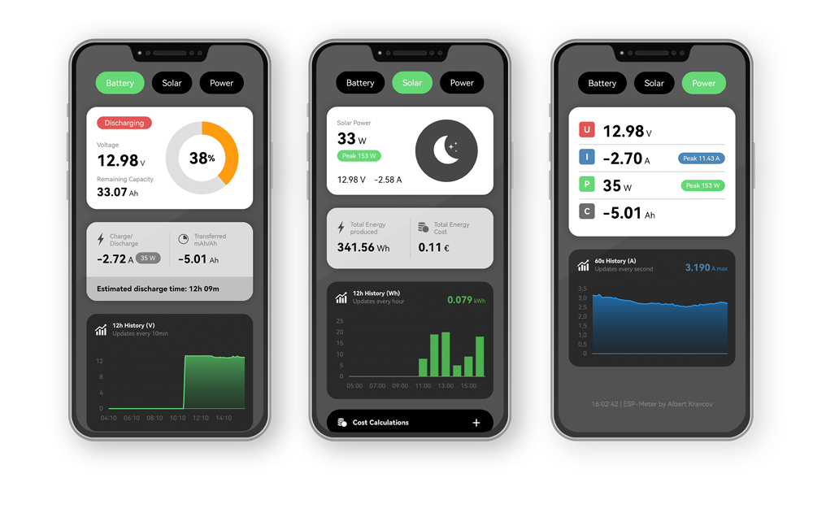
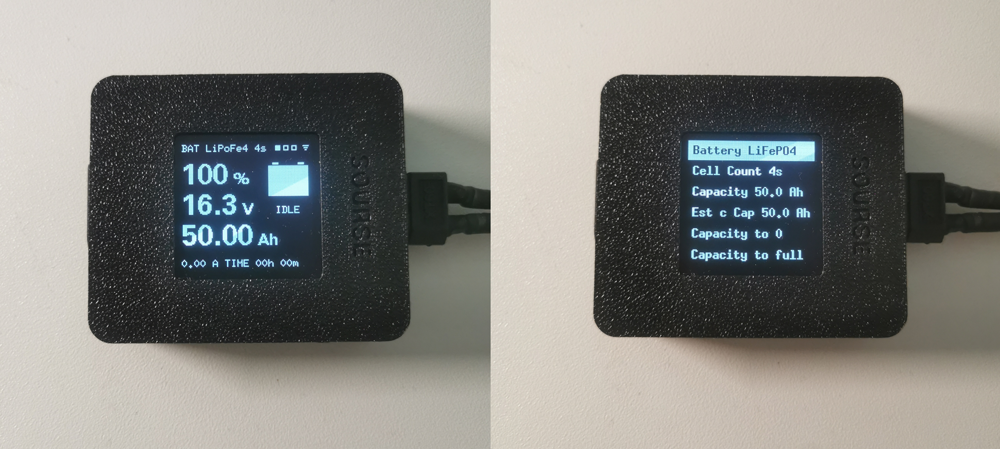
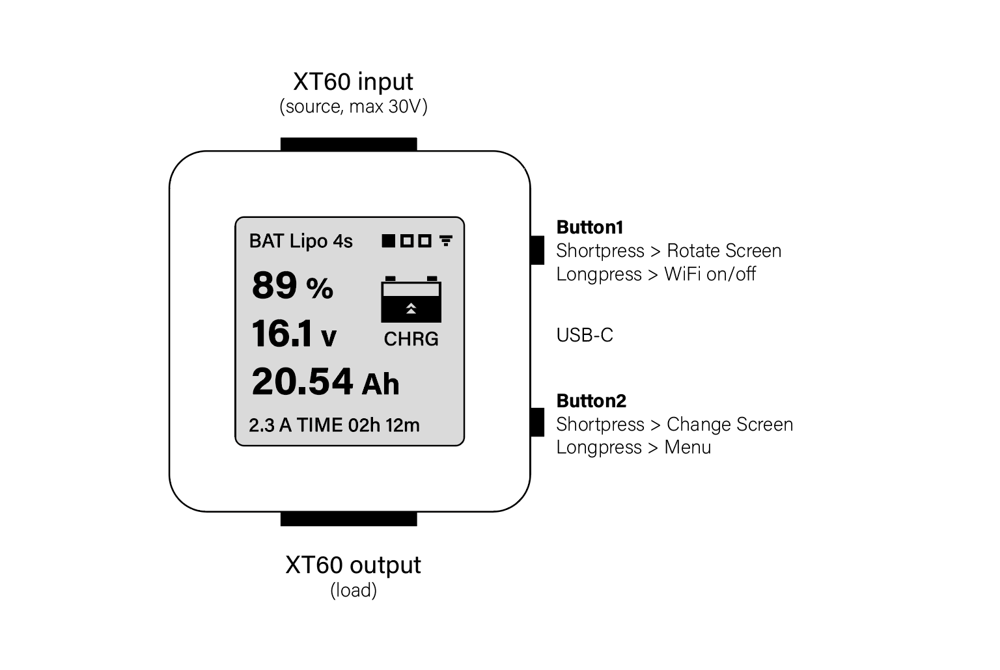
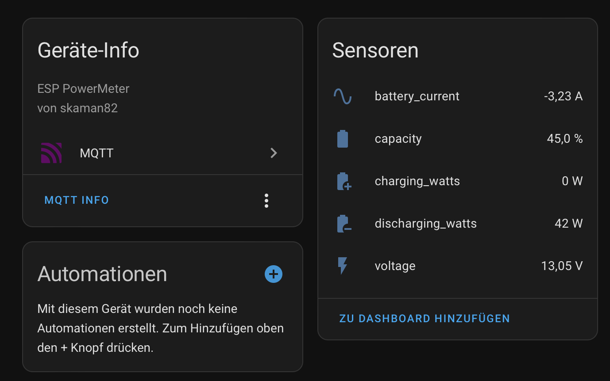
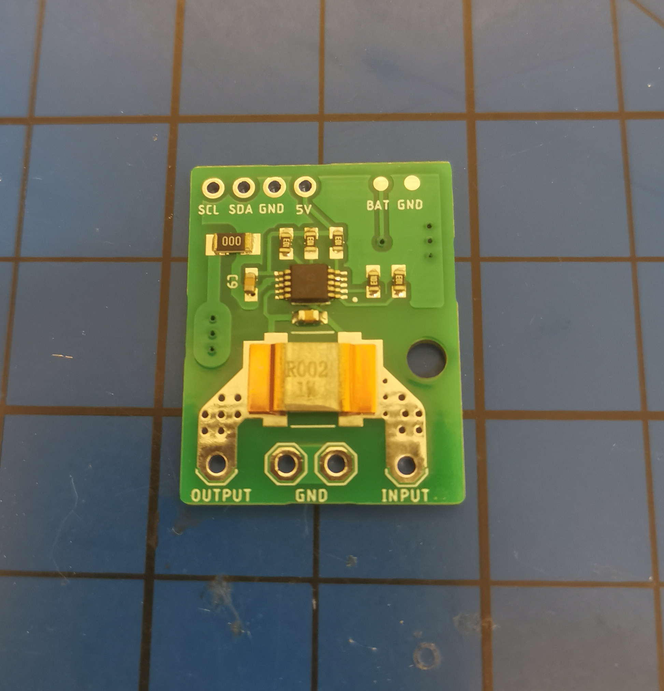

# **ESP PowerMeter**

Energy logging und current/voltage meter. Solar panel tester and a Home Assistant MQTT battery sensor
---
Web Interface:

## **Features**
- **3 Modes:** Coulometer / Solar Tester / Power Meter  
- **3 Battery Types Supported:** Li-ion, LiPo, LiFePO4  
- Fully configurable with **OLED UI**  
- **Wi-Fi Support:** Access Point mode or join an existing network  
- Additional **Web Interface**  
- **MQTT Support:** can be used as a sensor with Home Assistant  
- **Max Voltage:** 36V (listed 5V BEC supports max. 30V)  

---

## **Parts needed**
- **ESP32-C3 PRO MINI**  
- **5V BEC** (iFlight 5V 2-8S)  
- **INA226 Module** + 3920 5W 2mΩ Shunt (R002)  
 *or* custom INA226 PCB (see Hardware directory)
- **male/female XT60 connectors*
- **1.5" 128x128 I2C OLED Display** *(optional)*  
- **2x Tactile Buttons** *(optional)*
- **Real Time Clock RTC DS3231 module** *(optional)*  
- **3D Printed Case** (see STLs directory)  

## **RTC and NON-RTC Versions**
The main difference to the non-RTC version ist that the RTC version of the code uses an DS3231 real time clock for measurement and displays graph labels with the correct time in the Web-UI. 

---

Device Image:

## **Button Mapping**

## **MQTT Entities in Home Assistant**

Custom INA266 Sensor PCB with optional DS3231:

## **Connection Diagram**
*To be determined (TBD)*  

---

